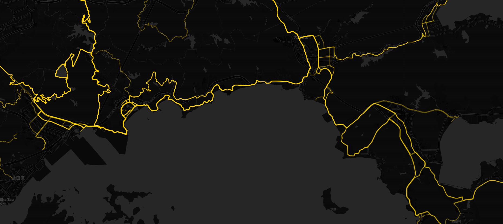

# Cycling Headmap: FIT-to-Heatmap Web Project



This project builds a lightweight web page that renders GPS points from FIT files as a heatmap on an interactive map.

## Quick start

1) Prepare Python environment

- Install deps:

```bash
pip install -r requirements.txt
```

2) Put your FIT files into a folder, you can download from your Strava or Garmin website.

- Example: create a `data/` folder and copy all your `.fit` files into it.

3) Run preprocessing

```bash
python scripts/fit_to_bin.py \
  --input data \
  --output public/points.bin \
  --sample 3
```

Notes:
- `--sample 3` keeps every 3 point (1/3). You can adjust this (e.g., 1, 10).

4) Serve the static site

- Quick local test:

```bash
python -m http.server --directory public 8080
```

Open http://localhost:8080


